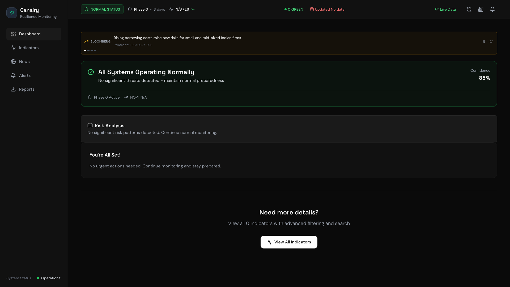
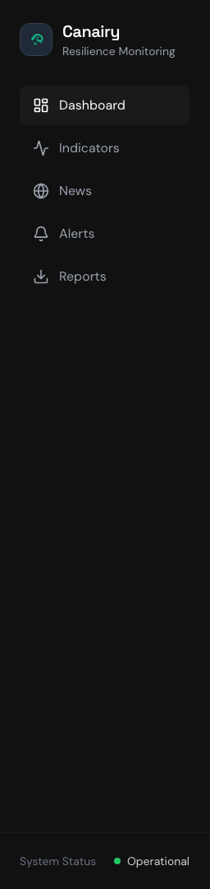
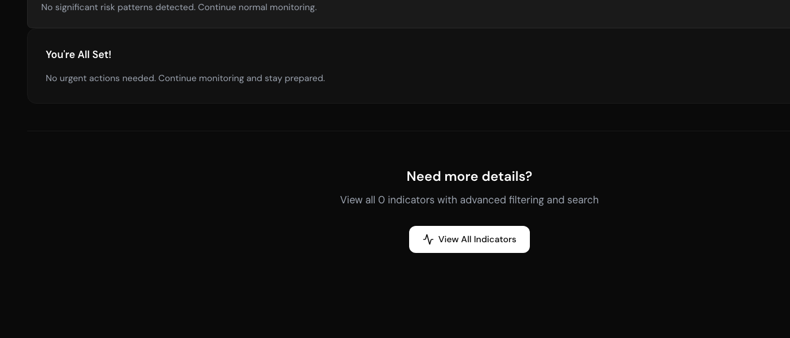
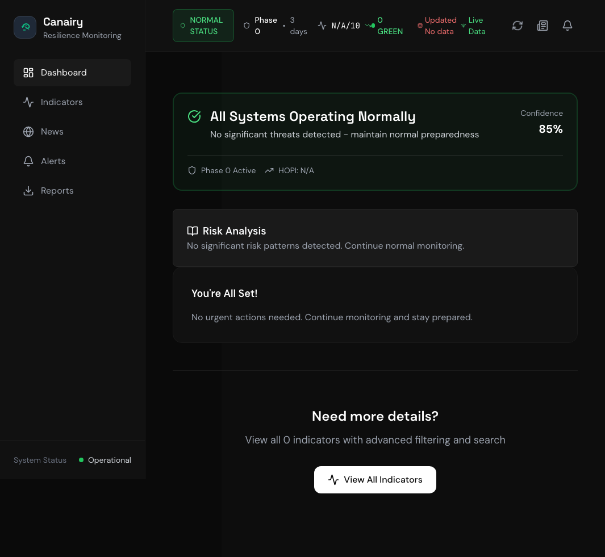

# 🐦 Canairy - Early Warning System for Global Disruptions

<div align="center">
  
  
  **Your Personal Canary in the Coal Mine**
  
  [](https://github.com/manavpthaker/canairy)
  [](https://github.com/manavpthaker/canairy/fork)
  [](https://github.com/manavpthaker/canairy/issues)
  
  [](https://reactjs.org/)
  [](https://www.typescriptlang.org/)
  [](https://tailwindcss.com/)
  [](LICENSE)
  []()
</div>

## 🚨 What is Canairy?

Canairy is a sophisticated early warning system that monitors 22 critical global indicators to help families prepare for potential disruptions before they impact daily life. Like a canary in a coal mine, it detects danger early - giving you time to act.

### 🎯 Key Features

- **🔍 Real-Time Monitoring**: Tracks 22 vital indicators across finance, supply chain, energy, and social domains
- **📰 Intelligent News Analysis**: AI-powered news filtering linked to specific risk indicators
- **📊 Advanced Visualization**: Interactive charts showing historical patterns and future projections
- **🚦 4-Phase Alert System**: Clear escalation from normal operations to crisis response
- **📱 Actionable Intelligence**: Specific steps to take based on current threat levels
- **🏦 Financial Protection**: Early warnings for banking stress and market crashes
- **🛒 Supply Chain Alerts**: Advance notice of shortages and price spikes
- **⚡ Energy Disruption Tracking**: Monitor risks to power grid and fuel supplies
- **🌍 Geopolitical Analysis**: Track global conflicts that could affect your region

## 📸 Screenshots

<div align="center">
  
  <p><em>Main Dashboard - All critical information at a glance</em></p>
</div>

<div align="center">
  
  <p><em>Critical Indicators Panel - Real-time threat assessment</em></p>
</div>

<div align="center">
  
  <p><em>Priority Actions - Know exactly what to do and when</em></p>
</div>

<div align="center">
  
  <p><em>Mobile-Responsive Design - Full functionality on all devices</em></p>
</div>

## 🌐 Live Demo

> **[🔗 Try Canairy Live](https://canairy.onrender.com)** - Experience the full dashboard with real-time data

**What you'll see:**
- 🚨 **Real-time threat assessment** across 22 critical indicators
- 📊 **Interactive charts** showing historical patterns and trends  
- 📰 **Live news intelligence** with AI-powered threat correlation
- 📱 **Mobile-responsive design** optimized for all devices
- ⚡ **Instant alerts** when conditions change

*No signup required - the demo uses real API data with live updates every 5 minutes.*

## 🚀 Quick Start

### Prerequisites

- Node.js 18+ and npm
- Python 3.10+ (for data collectors)
- API keys for data sources (free tiers available)

### Installation

1. **Clone the repository**
   ```bash
   git clone https://github.com/manavpthaker/canairy.git
   cd canairy
   ```

2. **Install dependencies**
   ```bash
   npm install
   ```

3. **Configure environment**
   ```bash
   cp .env.example .env
   # Edit .env with your API keys
   ```

4. **Start the system**
   ```bash
   npm run dev
   ```

5. **Access the dashboard**
   ```
   http://localhost:3005
   ```

## 📊 Monitored Indicators

### Financial Indicators
- **Treasury Tail Risk** - Banking system stress detector
- **VIX Volatility** - Market crash probability
- **mBridge Settlement** - Dollar dominance threats
- **Unemployment Rate** - Economic health gauge

### Supply Chain Indicators
- **Taiwan Exclusion Zone** - Semiconductor shortage risk
- **Strait of Hormuz** - Oil supply disruption
- **Baltic Dry Index** - Global shipping costs
- **Food Price Index** - Agricultural supply stress

### Energy & Infrastructure
- **Natural Gas Prices** - Heating/cooling costs
- **Power Grid Frequency** - Electrical stability
- **Cyber Attack Index** - Digital infrastructure threats

### Social & Geopolitical
- **ICE Detention Capacity** - Immigration enforcement
- **Global Conflict Index** - Military tensions
- **Civil Unrest Tracker** - Social stability

[View Complete Indicator List →](docs/user-guide/indicator-reference.md)

## 🔧 System Architecture

```
┌─────────────────┐     ┌─────────────────┐     ┌─────────────────┐
│   React UI      │────▶│  Backend API    │────▶│ Data Collectors │
│   Dashboard     │     │  (Python/Node)  │     │   (22 Sources)  │
└─────────────────┘     └─────────────────┘     └─────────────────┘
         │                       │                        │
         │                       ▼                        │
         │              ┌─────────────────┐              │
         └─────────────▶│   PostgreSQL    │◀─────────────┘
                        │   Time Series   │
                        └─────────────────┘
```

## 📖 Documentation

- [📚 User Guide](docs/user-guide/manual.md) - Complete usage instructions
- [🛠️ Technical Documentation](docs/technical/architecture.md) - System architecture and development
- [🔌 API Reference](docs/api/README.md) - Backend API documentation
- [🚀 Deployment Guide](docs/deployment/README.md) - Production deployment instructions
- [🔒 Security Guide](docs/deployment/security.md) - Security best practices
- [👨‍👩‍👧‍👦 Family Preparedness](docs/family/emergency-planning.md) - Emergency response planning

## 🌟 Why Canairy?

Traditional news and financial media often report on crises after they've already begun impacting daily life. Canairy changes this by:

1. **Monitoring Leading Indicators**: We track data that changes *before* mainstream awareness
2. **Connecting the Dots**: Our system identifies patterns across seemingly unrelated indicators
3. **Actionable Intelligence**: We don't just alert you - we tell you exactly what to do
4. **Family-Focused**: Designed for protecting households, not institutional investors

## 🤝 Contributing

We welcome contributions! Please see our [Contributing Guide](CONTRIBUTING.md) for details.

### Development Setup

```bash
# Install development dependencies
npm install

# Run tests
npm test

# Run linters
npm run lint
npm run typecheck

# Start development server with hot reload
npm run dev
```

## 📊 Data Sources

Canairy aggregates data from multiple reliable sources:

- **Financial Data**: Federal Reserve, Alpha Vantage, CBOE
- **News Intelligence**: News API, Reuters, Bloomberg
- **Government Data**: Treasury Direct, USDA, EIA
- **Market Data**: CME Group, ICE, Baltic Exchange
- **Geopolitical**: ACLED, Council on Foreign Relations

[View Complete Data Sources →](docs/technical/data-sources.md)

## 🔒 Security & Privacy

- All data is processed locally - no personal information leaves your system
- API keys are encrypted and stored securely
- Open source for complete transparency
- No tracking or analytics

## 📜 License

This project is licensed under the MIT License - see the [LICENSE](LICENSE) file for details.

## 🙏 Acknowledgments

- Inspired by Nassim Taleb's work on Black Swan events
- Phase system adapted from emergency management best practices
- Built with love for families who want to stay prepared

## 📞 Support

- 📧 Email: support@canairy.app
- 🐛 Issues: [GitHub Issues](https://github.com/manavpthaker/canairy/issues)
- 💬 Discussions: [GitHub Discussions](https://github.com/manavpthaker/canairy/discussions)

---

<div align="center">
  <strong>Stay Prepared. Stay Informed. Stay Safe.</strong>
  
  Made with ❤️ for families everywhere
</div>